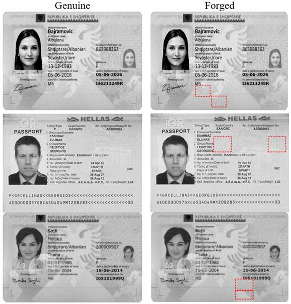

# FMIDV: Forged Mobile Identity Document Video dataset

This page presents a dataset for copy-move forgeries on the identity documents of MIDV-2020 dataset. The forged samples contain many Similar but Genuine Objects (SGO) which has been shown as a challenge for Copy-Move Forgery Detection (CMFD) algorithms and should be useful in many works in digital forensics research.

### FMIDV size and access
The dataset has a size of 4,7 GB and is hosted on an FTP server of the University of La Rochelle. Please fill this [form](https://forms.office.com/r/gVsSivTFYz) for getting access to the dataset. In  case of any problem, please contact (musab.alghadi@univ-lr.fr).

## Structure of genuine dataset (MIDV-2020)
MIDV-2020 dataset collects identity documents in four categories:
### 1-	Template category : comprises 1000 dummy identity documents
The original sample images obtained from Wikimedia Commons and edited to remove non-persistent data (such as signature, photo, and text field values).

### 2-	Photo category : comprises 1000 photos in resolution of 2268 × 4032
pixels
A photo was taken for each physical document sample, given various conditions and using two smartphones. Half of the photos were captured using Apple iPhone XR, and the other half using Samsung S10.
### 3-	Scan category : comprises 2000 scanned identity documents
Each physical document sample was scanned using Canon LiDE 220 and Canon LiDE 300 scanners, in two different modes (1000 for each).
Scanning modes: 
•	upright position (scan_upright.tar)
•	rotated to an arbitrary angle (scan_rotated.tar)
### 4-	Video clips category : comprises 1000 video clips
For each physical document sample a video clip was captured vertically using Apple iPhone XR and Samsung S10, in a resolution of 2160 × 3840 pixels, with 60 frames per second.

## Structure of forged dataset (FMIDV)
FMIDV dataset consists of 28k forged identity documents for 10 countries based on copy-move forgeries on the identity documents of MIDV-2020 dataset.
For each identity document in the template, photo and scan categories of MIDV- 2020, we have generated 7 forged samples based on copy-move operation.
Copy-move operations were applied on zones of sizes 16 × 16 and 32 × 32 and 64 × 64 pixels; selected randomly.
For 16 × 16 and 32 × 32 pixels copy-move forgeries were applied 2 times for 2
different zones, 2 times for 4 zones, and 2 times for 6 zones.
For 64 × 64 pixels copy-move forgery was applied 1 time for only 2 different zones; because we don't have enough available zones for applying this action for some countries e.g. Finland, Serbia and Slovakia. Moreover, applying copy-move operation on 64 × 64 zones are out of interest as they could be detected by manual inspection (naked eyes).

## FMIDV is structed as follows:
1-	forged_ templates: comprises 7K IDs for 10 countries.
2-	forged_photo: comprises 7K IDs for 10 countries.
3-	forged_ scan_rotated: comprises 7K IDs for 10 countries.
4-	forged_ scan_upright: comprises 7K IDs for 10 countries.

The format of any forged identity document in FMIDV is as follows: no._category_Px_Zy.png
no.: presents the sample number; 𝑛𝑜. = [00 − 99]
category: presents the category name that one sample belongs
 
Px: partition size; 𝑥 = {16, 32, 64}, if 𝑥 = 16 that means that copy-move operation done on zones of 16 × 16 etc.
Zy: presents number of selected zones; 𝑦 = {2, 4, 6}

## Demos of the samples

  
 

## Contacts
Dr. Musab Al-Ghadi musab.alghadi@univ-lr.fr

## Citation
@inproceedings{alGhadi2023,
title={Guilloche Detection for {ID} Authentication: A Dataset and Baselines},
author= {Musab Al-Ghadi and Zuheng Ming and Petra Gomez-Krämer and Jean-Christophe Burie and Micka\"{e}l Coustaty and Nicolas Sidere},
booktitle={Proceedings of the International Workshop on MultiMedia Signal Processing (MMSP)},
pages={1--6},
year={2023},
organization={IEEE}
}
