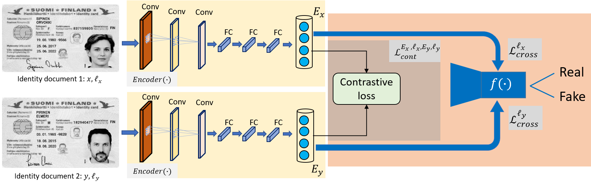
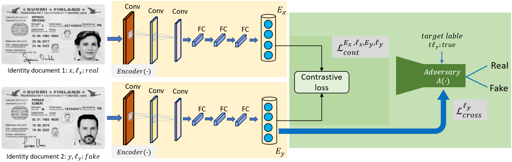

# Guilloche Detection for ID Authentication: A Dataset and Baselines
Git repository for the CheckID project (part1), carried out by Musab Al-Ghadi.

## BibTeX to cite this article
@inproceedings{alGhadi2023,
title={Guilloche Detection for {ID} Authentication: A Dataset and Baselines},
author= {Musab Al-Ghadi and Zuheng Ming and Petra Gomez-Krämer and Jean-Christophe Burie and Micka\"{e}l Coustaty and Nicolas Sidere},
booktitle={Proceedings of the International Workshop on MultiMedia Signal Processing (MMSP)},
pages={1--6},
year={2023},
organization={IEEE}
}

## Contents  

### 1- Contrastive based fraud detection (CFD) model. 
This model employs encoder-classifier sub-networks. The role of the encoder component (i.e. Siamese neural network) is to extract the features from a pair of IDs and compressing them into a lower-dimensional representations. While, the classifier component uses the encoded data to make predictions (i.e. classify the input ID into a real or fake ID). 
 

   
  
### 2- Fake-sample-adversary based fraud detection (FsAFD) model. 
The second model employs encoder-(fake-sampleadversary) sub-networks that consists of two main components: an encoder E(.) and an adversary A(.).
This model is similar to the CFD model, the ony difference is that the classifier network f(.) is replaced by a constrained-adversarial model A(.).
the role of the encoder component E(.) (i.e. backbone neural network) is to extract features from the input pair (x, y) and compressing them into a lower-dimensional representation Ex and Ey. And the adversary component A(.), also known as the discriminator, uses the encoded data to determine whether the input is real or fake.
 

   

## Models
We release the trained models on two datasets: MIDV and FMIDV for 10 countries. The models are named following the rule of "[modelName][country].tar" and can be downloaded here.
## Usage
### Training

### Testing

