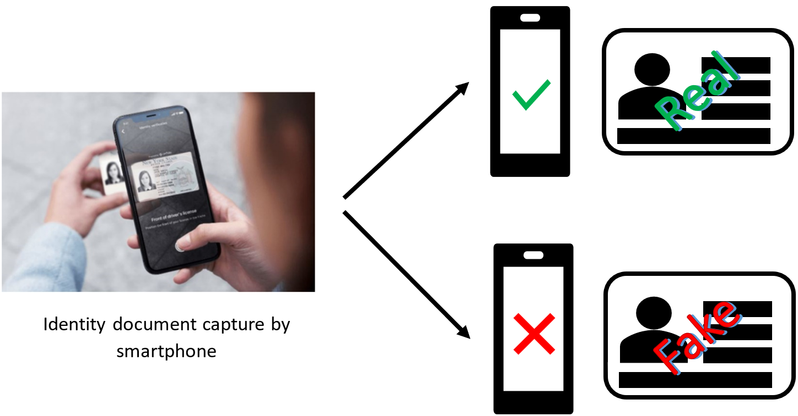
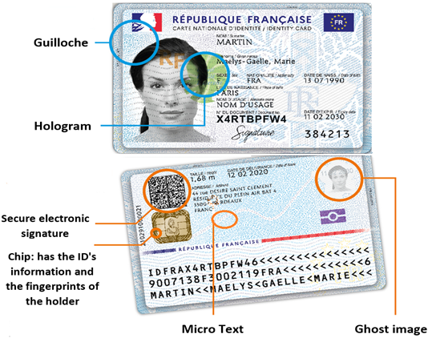

# CheckID: Check Identity Documents
Git repository for the CheckID project, carried out by Musab Al-Ghadi.

## Introduction  
With the explosion of the Internet and online registration services, identity document (ID) fraud and identity theft are on the rise. Therefore, companies need to be increasingly vigilant in their customer on-boarding processes. Fraud represents different risks for businesses: non-payment, money laundering, identity theft, etc. It therefore becomes necessary to verify customer identity documents.

  

  

  
 
 
### Verify customer’s identity documents remotely
ID verification confirms the legitimacy of an ID such as a passport, identity card or driving license. The company must verify its legitimacy, this verification includes the verification of the security elements integrated into the ID.

### Security elements integrated into identity documents
Identity documents (IDs) are always including more and more sophisticated security features in their designs in order to ward off potential counterfeiters, fraudsters and impostors. One of these security features is the Guilloche. The Guilloche design is a pattern of computer-generated fine lines that forms a unique shape. The target is to develop detection and verification approach of the Guilloche pattern in order to ensure the authenticity of the identity documents.

 

  
  
## Contents  

#### 1- Repository 1.  
Has the contents of the work entitled "Guilloche Detection for ID Authentication: A Dataset and Baselines", which has published in IEEE MMSP 2023.

#### Description of files in this repository 1  

- Codes

#### 2- Repository 2.   
Has the contents of the work entitled "Identifying Fraudulent Identity Documents by Analyzing Imprinted Guilloche Patterns", which has submitted into MTA journal.

#### Description of files in this repository 2  

## Citation
@inproceedings{alGhadi2023,
title={Guilloche Detection for {ID} Authentication: A Dataset and Baselines},
author= {Musab Al-Ghadi and Zuheng Ming and Petra Gomez-Krämer and Jean-Christophe Burie and Micka\"{e}l Coustaty and Nicolas Sidere},
booktitle={Proceedings of the International Workshop on MultiMedia Signal Processing (MMSP)},
pages={1--6},
year={2023},
organization={IEEE}

