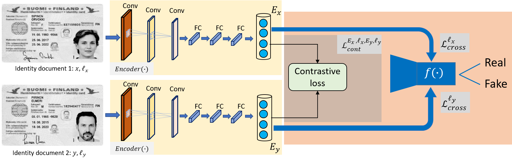
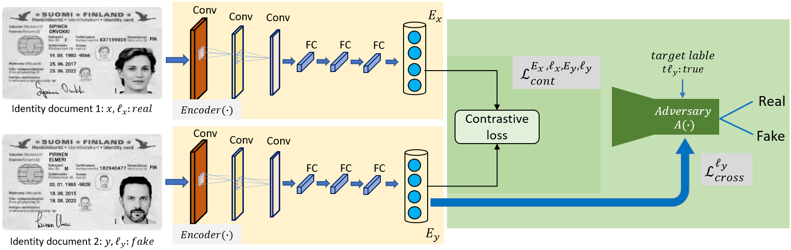

# CheckID: Guilloche Detection for Identity Document authentication
Git repository for the CheckID project, carried out by Musab Al-Ghadi.

## Introduction  

Identity documents (IDs) are always including more and more sophisticated security features in their designs in order to ward off potential counterfeiters, fraudsters and impostors. One of these security features is the Guilloche. The Guilloche design is a pattern of computer-generated fine lines that forms a unique shape. The target is to develop detection and verification approach of the Guilloche pattern in order to ensure the authenticity of the identity documents.

   
  
## Contents  

1- CFD_model  
This model employs encoder-classifier sub-networks. The role of the encoder component (i.e. Siamese neural network) is to extract the features from a pair of IDs and compressing them into a lower-dimensional representations. While, the classifier component uses the encoded data to make predictions (i.e. classify the input ID into a real or fake ID).

   
2- FsAFD_model.   
The second model employs encoder-(fake-sampleadversary) sub-networks that consists of two main components: an encoder E(.) and an adversary A(.).
This model is similar to the CFD model, the ony difference is that the classifier network f(.) is replaced by a constrained-adversarial model A(.).
the role of the encoder component E(.) (i.e. backbone neural network) is to extract features from the input pair (x, y) and compressing them into a lower-dimensional representation Ex and Ey. And the adversary component A(.), also known as the discriminator, uses the encoded data to
determine whether the input is real or fake.

   

## Description of files in this repository  

- Codes

